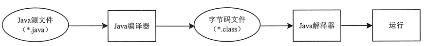

# 特性 Java的一些语言特点

## Java 程序运行过程

    一个java程序由设计到运行 由三部分构成

    编写	进行 java后缀的源文件的编写

    编译	使用JDK 自带的Javac 编译器对java文件进行编译，生成以.class结尾的 二进制字节码文件

    运行	使用java 解释器将 字节码翻译为机器码 执行

## JAVA的跨平台

    java的跨平台是通过 将 Java 代码翻译为字节码文件来实现的

    通过将java语言编写的程序 转换为 二进制字节码 提供给 安装在不同设备上的可以实现相同行为的java编译器对代码进行编译来实现

## JDK JRE 和 JVM

    JDK Java Development Kit  Java 开发工具包

    JRE Java Runtime Environment Java 运行时环境

    JVM Java Virtual Machine Java 虚拟机环境

## 与C的不同

1. 指针  C++ 支持指针，而 Java 没有指针的概念。
2. 继承方式  C++ 支持多继承，而 Java 不支持多重继承，但允许一个类实现多个接口。
3. 面向对象  Java 是完全面向对象的语言，并且还取消了 C/C++ 中的结构和联合，使编译程序更加简洁
4. 垃圾回收 Java 自动进行无用内存回收操作，不再需要程序员进行手动删除，而 C++ 中必须由程序释放内存资源，这就增加了程序员的负担。
5. 运算符重载  Java 不支持操作符重载，操作符重载则被认为是 C++ 的突出特征。
6. 预处理  Java 允许预处理，但不支持预处理器功能，所以为了实现预处理，它提供了引入语句（import），但它与 C++ 预处理器的功能类似。
7. 缺省参数  Java 不支持缺省参数函数，而 C++ 支持 。
8. 字符串变量  C 和 C++ 不支持字符串变量，在 C 和 C++ 程序中使用“Null”终止符代表字符串的结束。在 Java 中字符串是用类对象（String 和 StringBuffer）来实现的
9. goto   goto 语句是 C 和 C++ 的“遗物”，Java 不提供 goto 语句，虽然 Java 指定 goto 作为关键字，但不支持它的使用，这使程序更简洁易读。
10. 类型强制转换 Java 不支持 C++ 中的自动强制类型转换，如果需要，必须由程序显式进行强制类型转换。
